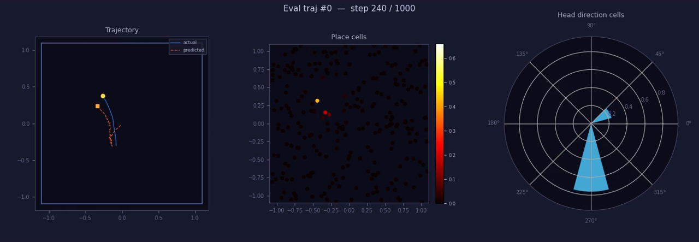

# grid-cells-torch

[🌐 中文](README.zh.md)

A faithful PyTorch port of [`google-deepmind/grid-cells`](https://github.com/google-deepmind/grid-cells), later expanded into a more practical workflow for data generation, evaluation, visualization, logging, and analysis.

## ✨ Results

Reference run: `results/20260416-040934`, snapshot at `epoch 12`.
README-safe assets are mirrored under `docs/assets/readme/`.

| Metric | Value |
|---|---:|
| `pos_mse` | `0.027598` |
| `grid_score_60 max` | `1.3284` |
| `grid_score_90 max` | `1.5351` |

[](docs/assets/readme/eval_animation_epoch_0012.mp4)

Video: `docs/assets/readme/eval_animation_epoch_0012.mp4`

[PDF 1](docs/assets/readme/rates_and_sac_epoch_0012.pdf) | [PDF 2](docs/assets/readme/hdc_tuning_epoch_0012.pdf)


## 🚀 Beyond The Official Repo

- Pre-generated `train/eval` datasets, with on-the-fly fallback.
- Compact `train.log` and TensorBoard logging.
- Decoded-position metric `pos_mse` for training and evaluation.
- Paginated rate-map PDFs, HDC tuning PDFs, and shared 3-panel MP4s for eval and generated data.
- CLI-oriented data generation, visualization, and experiment management.

## 📚 References

| Reference | Role |
|---|---|
| Banino et al. (2018), [Vector-based navigation using grid-like representations in artificial agents](https://doi.org/10.1038/s41586-018-0102-6) | Original Nature paper |
| DeepMind official implementation, [google-deepmind/grid-cells](https://github.com/google-deepmind/grid-cells) | Original codebase this repo started from |

## 🧭 Overview

This repository started as a strict PyTorch port of DeepMind's official `grid-cells` codebase. It was later extended with fixed dataset generation, evaluation PDFs, HDC tuning plots, shared 3-panel MP4 animations, TensorBoard logging, a decoded-position metric (`pos_mse`), and a more complete CLI workflow for reproducible experiments.

## ⚡ Quick Start

```bash
pip install torch numpy scipy matplotlib pyyaml tqdm tensorboard

# install ffmpeg if you want MP4 outputs
# Ubuntu / Debian
sudo apt-get update && sudo apt-get install -y ffmpeg

# macOS
brew install ffmpeg

# generate train/eval splits plus preview artifacts
python generate_data.py --visualize --animate

# speed up preview videos by sampling every other step
python generate_data.py --animate --anim_step 2

# train with the generated dataset
python train.py

# or override the shared animation config for eval videos
python train.py --visualization.anim_num_traj 4 --visualization.anim_step 2

# or print the common command list
bash run_scripts.sh

# inspect metrics
tensorboard --logdir results
```

Default convention:

- Train split: `data/train.npz`
- Eval split: `data/eval.npz`
- Run directory: `results/<timestamp>/`

If `data/train.npz` is missing, `train.py` falls back to on-the-fly trajectory generation.

## 📦 Outputs

- `train.log`: compact training log.
- `tensorboard/`: scalar metrics and config snapshot.
- `rates_and_sac_epoch_XXXX.pdf`: rate maps and spatial autocorrelograms.
- `hdc_tuning_epoch_XXXX.pdf`: HDC tuning curves.
- `eval_animation_epoch_XXXX.mp4`: eval-style 3-panel trajectory animation.

## 🗂️ Repo Layout

```text
grid-cells-torch/
├── docs/assets/readme/
├── config.yaml
├── generate_data.py
├── train.py
├── model.py
├── animation.py
├── dataset.py
├── encoding.py
├── ensembles.py
├── evaluation.py
├── scores.py
├── training_session.py
├── trajectory_generation.py
├── utils.py
└── results/
```

<details>
<summary>🔍 More Details</summary>

- `config.yaml` is the default experiment entry point and supports CLI overrides, for example `python train.py --training.epochs 100 --training.lr 1e-3`.
- `generate_data.py` can export `.npz`, PDF summaries, and the same 3-panel MP4 animation style used by eval outputs.
- OOP-oriented orchestration now lives in dedicated modules: `encoding.py` centralizes ensemble encoding, `animation.py` owns trajectory rendering, `evaluation.py` owns eval/export flow, `training_session.py` owns the train loop, and `trajectory_generation.py` owns random-walk synthesis.
- Shared animation defaults live under `visualization.anim_*` in `config.yaml`, and both `train.py` and `generate_data.py` can override them from the CLI.
- `run_scripts.sh` prints a compact list of common train, generate, and TensorBoard commands.
- The current default config is tuned for the expanded engineering workflow, not a line-by-line lockstep copy of the original hyperparameters.
- README media is mirrored from selected run outputs into `docs/assets/readme/` so the landing page does not depend on ignored `results/` files.

</details>

## 🙏 Acknowledgements

This project was developed with substantial help from Claude Code (Claude Sonnet 4.6) and OpenCode (GPT-5.4). The main development work took about one day and used four Claude Code Pro sessions plus two GPT Plus sessions, with a notably fast iteration cycle.
