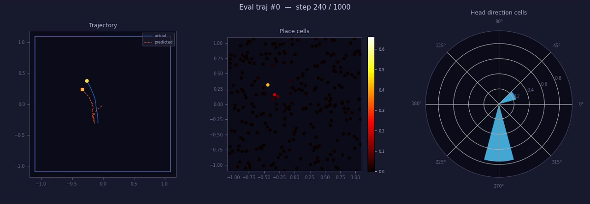

# grid-cells-torch

[🌐 English](README.md)

本仓库最初是对 [`google-deepmind/grid-cells`](https://github.com/google-deepmind/grid-cells) 的忠实 PyTorch 迁移，之后扩展成了更实用的数据生成、评估、可视化、日志与分析工作流。

## ✨ 结果

参考运行：`results/20260416-040934`，展示快照为 `epoch 12`。
适合 README 发布的资源已镜像到 `docs/assets/readme/`。

| 指标 | 数值 |
|---|---:|
| `pos_mse` | `0.027598` |
| `grid_score_60 max` | `1.3284` |
| `grid_score_90 max` | `1.5351` |



[PDF 1](docs/assets/readme/rates_and_sac_epoch_0012.pdf) | [PDF 2](docs/assets/readme/hdc_tuning_epoch_0012.pdf)


## 🚀 相比官方仓库的扩展

- 预生成 `train/eval` 数据集，并保留在线生成回退模式。
- 精简 `train.log` 和 TensorBoard 日志，包括 per-module 梯度诊断指标。
- 在训练与评估中记录解码位置和头朝向指标，包括全序列 `pos_mse` / `hd_mae_rad`，以及首个时间步诊断指标 `first_pos_mse` / `first_hd_mae_rad`。
- 支持分页 rate-map PDF、HDC tuning PDF，以及训练评估和数据生成共用的 3-panel MP4。
- 可选 bottleneck 单元统计分析，包括 circular-shift grid-score 显著性、split-half reliability、头朝向选择性，以及独立的 v1 linear spatial-PCA gridness baseline。`model.bottleneck_post_activation` 控制模型内 post-linear bottleneck transform；`analysis.bottleneck_activation` 控制 eval/analysis 对模型返回 bottleneck 的额外 transform，`raw` 表示不再额外变换。
- 提供以 CLI 为中心的数据生成、可视化和实验管理流程。

## 📚 参考

| 参考项 | 作用 |
|---|---|
| Banino et al. (2018), [Vector-based navigation using grid-like representations in artificial agents](https://doi.org/10.1038/s41586-018-0102-6) | 原始 Nature 论文 |
| DeepMind 官方实现, [google-deepmind/grid-cells](https://github.com/google-deepmind/grid-cells) | 本仓库最初对齐的原始代码库 |

## 🧭 概览

本仓库一开始严格对齐 DeepMind 官方 `grid-cells` 实现，并将核心训练流程迁移到 PyTorch。之后又加入了固定数据集生成、评估 PDF、HDC tuning 图、共用的 3-panel MP4 动画、TensorBoard、全序列与首个时间步的位置/头朝向解码指标，以及更完整的 CLI 工作流，更适合做可复现实验和后续分析。

代码采用以 `grid_cells/` 为根的分层 Python 包结构。根目录提供 `train.py`、`generate_data.py` 和 `analyze_checkpoint.py` 三个 CLI 入口；库代码导入统一使用 `grid_cells.*` 路径。

## ⚡ 快速开始

```bash
pip install torch numpy scipy matplotlib pyyaml tqdm tensorboard

# 如果需要导出 MP4，请先安装 ffmpeg

sudo apt-get update && sudo apt-get install -y ffmpeg

# 默认会生成一个数据集目录到 data/datasets/<dataset-id>/，并导出预览产物
python generate_data.py --visualize --animate

# 调大动画采样步长，缩短预览视频
python generate_data.py --animate --visualization.anim_step 2

# 从 config.yaml 默认值出发做一次性覆盖
python generate_data.py --data_generation.num_samples 5000 --task.seq_len 800

# 显式指定输出路径时，可使用文件模式
python generate_data.py --output data/train_small.npz --eval_output data/eval_small.npz

# 训练默认读取 data/latest/train.npz 和 data/latest/eval.npz
python train.py

# 或指定优化器
python train.py --training.optimizer lion

# 或每完成 5 个 epoch 保存一次 periodic checkpoint
python train.py --training.checkpoint_every 5

# 或从已保存 checkpoint 重新导出完整 eval/analysis 产物
python analyze_checkpoint.py --checkpoint results/<run>/checkpoints/checkpoint_epoch_0005.pt

# 或指定包含 train.npz 和 eval.npz 的数据集目录
python train.py --training.datadir data/datasets/<dataset-id>

# 或切换到 step 学习率调度
python train.py --training.lr_scheduler step --training.lr_step_size 10 --training.lr_gamma 0.8

# 或按最大绝对梯度值等比缩放全部梯度
python train.py --training.grad_clip_mode norm --training.grad_clip_scope all --training.grad_clip_norm_type inf

# 或把选中梯度替换成带符号的逐参数平均幅值
python train.py --training.grad_processing_mode sign_mean_abs --training.grad_clip_scope all --training.grad_clip 1e-5

# 也可以覆盖评估视频共用的动画参数
python train.py --visualization.anim_num_traj 4 --visualization.anim_step 2

# 或在快速运行中降低统计分析成本
python train.py --analysis.num_shuffles 20 --analysis.scale_discreteness_num_shuffles 50 --analysis.max_eval_trajectories 64

# 或只运行 per-unit Banino-style grid geometry 分析
python train.py --analysis.compute_grid_selectivity false --analysis.compute_grid_geometry true --analysis.compute_shuffle_significance false --analysis.compute_split_half false --analysis.compute_hd_selectivity false

# 或不加额外 eval transform，直接分析模型返回的 bottleneck
python train.py --analysis.bottleneck_activation raw

# 或启用 v1 linear spatial-PCA gridness baseline diagnostics
python train.py --analysis.compute_linear_spatial_pca true --analysis.linear_spatial_pca_top_k 16 --analysis.linear_spatial_pca_num_shuffles 20 --analysis.linear_spatial_pca_plot_top_n 16

# 或显式指定推荐的 scale-invariant 解析解码合同
python train.py --task.targets_type softmax --task.lstm_init_type softmax --task.decode_type analytic

# 或查看常用命令清单
bash run_scripts.sh

# 查看指标
tensorboard --logdir results
```

默认约定：

- 默认生成目录：`data/datasets/<dataset-id>/`
- 默认训练入口（最新 train）：`data/latest/train.npz`
- 默认训练入口（最新 eval）：`data/latest/eval.npz`
- 最新固定 cell centers：`data/latest/cells.npz`
- 结果目录：`results/<timestamp>/`

目录模式成功生成后，会把最新的 `train.npz`、`eval.npz` 和 `cells.npz` 暴露到 `data/latest/`；`train.py` 会先从 `training.datadir`（默认 `data/latest`）查找这些 split 文件和固定 cell centers。

如果 `data/latest/train.npz` 不存在，`train.py` 会回退到在线生成轨迹模式。

`task.targets_type=normalized` 使用独立 cell-activation target，而不是 population probability distribution；PC 和 HDC 的 normalized target 都以 1 作为峰值，使用 sigmoid/BCE loss 训练，并用 sigmoid activation weighted mean 解码。默认且推荐的解析解码合同仍是 `targets_type=softmax`。

`task.pc_target_family` 独立选择 place-cell target family，不改变 PC/HDC 共享的 `task.targets_type` mode。`gaussian` 保持默认 Gaussian place-cell target。`difference_of_gaussians` 在 `task.pc_target_normalization=global` 时对应参考项目的 Difference of Softmaxes / DoS；设为 `none` 时相减 raw Gaussian response。`true_difference_of_gaussians` 直接相减 center 和 surround 的 raw Gaussian response。DoS 和 true DoG 都用 `task.pc_surround_scale` 作为 surround sigma multiplier，相减后平移到非负并按 place cell 维度归一化。非 Gaussian PC target family 会让 analytic 位置解码自动回退到 weighted decoding。

`training.first_pos_loss_multiplier` 控制 timestep-0 place-cell target loss 权重，但不会额外加入 decoded `first_pos_mse` auxiliary loss。

## 📦 输出内容

- `train.log`：精简训练日志。
- `config.yaml`：应用 CLI 覆盖后的 effective 训练配置，并包含最终结果目录。
- `tensorboard/`：标量指标和配置快照，包括首个时间步预测诊断指标，以及采样的 per-module gradient norm、最大绝对梯度和 clip ratio。
- `checkpoints/checkpoint_epoch_XXXX.pt`：按配置在完成指定 epoch 后保存的 save-only checkpoint。
- `checkpoints/checkpoint_final.pt`：训练正常完成后保存的 final save-only checkpoint。
- `ckpt_analysis/<checkpoint_stem>/`：`analyze_checkpoint.py` 的默认输出目录，用于从已保存 checkpoint 重新导出完整 eval/analysis 产物，并避免覆盖训练时产物。
- `eval_plots/rates_and_sac_epoch_XXXX.pdf`：由模型返回的 bottleneck 经过配置的 analysis transform 后计算出的 rate map 和空间自相关图。
- `eval_plots/hdc_tuning_epoch_XXXX.pdf`：HDC tuning 曲线。
- `eval_videos/eval_animation_epoch_XXXX.mp4`：按顺序拼接后的 eval 轨迹动画；多条轨迹会合成一个视频。
- `eval_stats/grid_stats_epoch_XXXX.csv`、`eval_stats/grid_stats_epoch_XXXX.npz`、`eval_stats/grid_stats_summary_epoch_XXXX.json`、`eval_stats/grid_scale_histograms_epoch_XXXX.pdf`、`eval_stats/grid_scale_histograms_epoch_XXXX.png`：当 `analysis.enabled=true` 时导出的 bottleneck 单元 grid 显著性、Banino-style grid scale、split-half reliability、头朝向选择性和 mixed-selectivity 计数，使用模型返回的 bottleneck 经过配置的 analysis transform 后的值。可用 `analysis.compute_grid_selectivity`、`analysis.compute_grid_geometry`、`analysis.compute_shuffle_significance`、`analysis.compute_split_half` 和 `analysis.compute_hd_selectivity` 单独开关统计模块；关闭的模块仍保留 artifact 字段，并写入 `NaN` 或 `false` 占位值。Grid-scale summary 同时包含所有 finite per-unit scales，限制在 FDR-significant grid units 上的 `grid_fdr_*` 版本，以及限制在 `grid_score_60 >= analysis.gridness_threshold` units 上的 `grid_threshold_*` 版本，包括 Banino-style discreteness shuffle 显著性和 1D GMM/BIC scale-cluster fitting。Scale histogram 图会展示所选 population 的 scale 分布，并叠加拟合出的 GMM 曲线和各 component 峰位。
- `eval_stats/linear_spatial_pca_modes_epoch_XXXX.csv`、`eval_stats/linear_spatial_pca_modes_epoch_XXXX.npz`、`eval_stats/linear_spatial_pca_summary_epoch_XXXX.json`、`eval_stats/linear_spatial_pca_overview_epoch_XXXX.pdf`、`eval_stats/linear_spatial_pca_overview_epoch_XXXX.png`、`eval_stats/linear_spatial_pca_mode_maps_epoch_XXXX.pdf`：当 `analysis.enabled=true` 且 `analysis.compute_linear_spatial_pca=true` 时导出的可选 v1 baseline diagnostics，使用模型返回的 bottleneck 经过配置的 analysis transform 后的值。该 baseline 在 fit trajectories 上拟合正交 spatial-PCA 方向，在 held-out trajectories 上评估投影 mode 的 gridness，并记录 `not_grid_score_optimized=true`；它不是直接优化 grid score 的 `W` 搜索。Overview 图展示 held-out mode grid scores、fit variance explained、shuffle-null `T`、variance-vs-gridness scatter 和 `W_top.T` loadings。Mode-map PDF 按 held-out grid score 排序展示前 `analysis.linear_spatial_pca_plot_top_n` 个 mode，包括 fit/test rate maps、held-out SACs 和 loading weights。设置 `analysis.linear_spatial_pca_save_plots=false` 时只写 CSV/NPZ/JSON 数据 artifact。

## 🗂️ 仓库结构

```text
grid-cells-torch/
├── config.yaml
├── analyze_checkpoint.py
├── generate_data.py
├── train.py
├── grid_cells/
│   ├── common/
│   ├── cells/
│   ├── data/
│   ├── training/
│   ├── analysis/
│   └── viz/
├── tests/
├── docs/assets/readme/
└── results/
```

<details>
<summary>🔍 更多说明</summary>

- `config.yaml` 是默认实验入口，并支持命令行覆盖，例如 `python train.py --training.epochs 100 --training.lr 1e-3`。
- 每次训练都会把应用 CLI 覆盖后的 effective config 保存到 `<run directory>/config.yaml`。
- Checkpoint 当前是 save-only 产物，尚未实现从 checkpoint 恢复训练。可以用 `analyze_checkpoint.py --checkpoint <path>` 从 checkpoint 权重重新导出完整 eval/analysis 产物；默认输出到 `<run directory>/ckpt_analysis/<checkpoint_stem>/`，也可以用 `--output_dir` 指定其它目录。
- 优化器：`training.optimizer` 支持 `rmsprop`、`adamw`、`adam`、`sgd` 和 `lion`；`training.betas` 设置后作用于 Adam、AdamW 和 Lion；`training.adamw_eps` 作用于 Adam 和 AdamW；`training.momentum` 作用于 RMSprop 和 SGD。
- 学习率调度支持 `cosine`、`step` 和 `none`；StepLR 使用 `training.lr_step_size` 和 `training.lr_gamma`。
- 梯度处理使用 `training.grad_processing_mode`。`clip` 使用 `training.grad_clip_mode`（`value` 逐元素裁剪或 `norm` 等比缩放）；`sign_mean_abs` 会把选中梯度替换成带符号的逐参数平均幅值，并把 `abs(grad) <= training.grad_clip` 的元素置 0。`training.grad_clip_scope` 支持 `decoder` 和 `all`，`training.grad_clip_norm_type: "inf"` 表示按最大绝对梯度值做 norm clipping。训练会采样记录 `state_init`、`cell_init`、`lstm`、`bottleneck`、`pc_heads` 和 `hdc_heads` 的 per-module 梯度诊断；TensorBoard 的 step 和 epoch-mean 标量位于 `train/grad/<module>/...`，包括 norm、RMS、mean-absolute、带符号 mean、max-absolute、`pre_clip_exceed_frac`（处理前 `abs(grad) > abs(training.grad_clip)` 的比例）、`clip_changed_frac`、`post_clip_saturated_frac` 和 `clip_ratio`，`train.log` 会记录精简的 epoch sampled mean。
- `train.py` 和 `generate_data.py` 现在统一使用显式的 `--section.key value` 覆盖风格。
- `generate_data.py` 默认会在 `data/datasets/<dataset-id>/` 下生成一个完整数据集目录，写入元数据和 `cells.npz`，并同步 `data/latest/*` 作为训练默认入口。
- `train.py --training.datadir data/datasets/<dataset-id>` 会优先加载 `<datadir>/train.npz`、`<datadir>/eval.npz` 和 `<datadir>/cells.npz`，再回退到 legacy 的 `training.data_path` 与 `training.eval_data_path` 字段。
- `task.cells_path` 可以显式指定固定的 `cells.npz`；否则训练会在存在时自动加载 `<training.datadir>/cells.npz`。
- `task.pc_target_family` 是 PC-only target encoding；DoS/DoG 应放在这里，不要加入共享的 `task.targets_type`，因为后者也配置 HDC targets 和 loss mode。
- 显式传入 `--output` / `--eval_output` 时，可以使用文件模式生成。
- 长期复用的数据生成默认值放在 `config.yaml` 的 `data_generation.*` 下；目录模式使用数据集目录内的固定输出路径，`data_generation.*_output` 只用于显式 `--output` / `--eval_output` 文件模式。`--visualize`、`--animate`、`--train_only`、`--visualize_progress` 这类一次性运行开关继续保留在 CLI。
- 分层包边界如下：
  `grid_cells/common` 管理共享配置辅助。
  `grid_cells/cells` 管理 ensembles、encoding 和 model。
  `grid_cells/data` 管理 dataset IO、数据生成、预览和轨迹合成。
  `grid_cells/training` 管理 CLI 解析、runtime 装配、evaluation 和训练 session。
  `grid_cells/analysis` 管理评分与绘图辅助。
  `grid_cells/viz` 管理动画渲染。
- 共享动画默认参数统一放在 `config.yaml` 的 `visualization.anim_*` 下，`train.py` 和 `generate_data.py` 都可以通过 CLI 覆盖。
- `model.bottleneck_post_activation` 控制模型内 bottleneck linear 之后、dropout 和输出头之前的 transform。统计评估参数统一放在 `analysis.*` 下；`analysis.bottleneck_activation` 控制 eval rate-map/grid-score 和统计分析输入，`raw` 表示使用模型返回的 bottleneck 而不加额外 eval transform。`analysis.max_eval_trajectories` 会限制 `spatial_stats` 和可选 linear spatial-PCA 分析保留的 eval 子集大小。
- 训练始终会先在 epoch 0 执行一次 baseline evaluation，然后每完成 `training.eval_every` 个 epoch 再评估一次。`training.eval_plot_every` 按这些 evaluation 调用计数，包括 epoch 0 baseline，用来决定是否导出 PDF 和动画。
- 首个时间步指标会解码模型在 timestep 0 的输出，并与 `target_pos[:, 0]` / `target_hd[:, 0]` 比较。这个目标是第一步速度更新后的状态，不是用于初始化 LSTM 的原始 `init_pos` / `init_hd`。
- 常见覆盖示例：
  `python train.py --task.env_size 2.4 --training.batch_size 32`
  `python train.py --training.lr_scheduler step --training.lr_step_size 10 --training.lr_gamma 0.8`
  `python generate_data.py --visualization.anim_fps 30 --data_generation.num_workers 4`
- `run_scripts.sh` 会打印一份精简的常用训练、数据生成、checkpoint analysis 和 TensorBoard 命令清单。
- 项目维护说明和工作流契约集中放在 `docs/maintenance.md`。
- 当前默认配置更偏向扩展后的工程化实验流程，而不是对原始超参数做逐行逐值锁定。
- README 中使用的媒体资源会从选定运行结果镜像到 `docs/assets/readme/`，避免首页依赖被忽略的 `results/` 文件。

</details>

## 🙏 致谢

本项目的主要开发工作在很大程度上依赖 Claude Code和 OpenCode 的协助。
